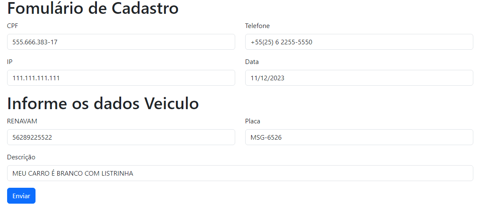

# Aplicando máscaras com ngx-mask

Neste projeto, temos um exemplo de como podemos construir um formulário com máscaras nos inputs para CPF, telefone, data, IP, RENAVAM e Placa dentre outros.

```json
Angular CLI: 16.2.7
Node: 18.16.0
Package Manager: npm 9.5.1
```

Como o exemplo será construído utilizando Angular 16, a versão do ngx-mask deve ser a 16 conforme indicado na [documentação oficial](https://github.com/JsDaddy/ngx-mask?ref=consolelog.com.br): 

Configurando o projeto para usar ngx-mask
Com o projeto já criado e as dependências instaladas, para começar a utilizar o ngx-mask, importe o `NgxMaskDirective` e registre o `provideNgxMask()` no arquivo `app.module.ts`

### Lista dos patterns:

    0: somente número
    9: somente número, porém, opcional
    A: letra (maiúscula ou minúscula) ou número
    S: somente letra (minúscula ou maiúscula)
    U: somente letra maiúscula
    L: somente letra minúscula

### Além dessa lista de patterns, há outras opções como por exemplo:
    IP - aplica uma máscara e valida o valor digitado
    percent - utilizado para porcentagem
    CPF_CNPJ - aplica uma máscara para CPF ou CNPJ
    Hh:m0:s0 - máscara para hora (24h), minuto e segundo
    d0/M0/0000 - máscara para data, mês e ano

A lista completa pode ser acessada neste [link](https://github.com/JsDaddy/ngx-mask/blob/develop/USAGE.md?ref=consolelog.com.br).

### Formulário Preenchido com as máscaras


<h1 align="center">💻 Desenvolvido Por: Gilberto Júnior</h1>